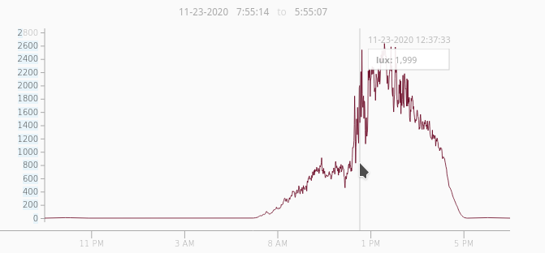
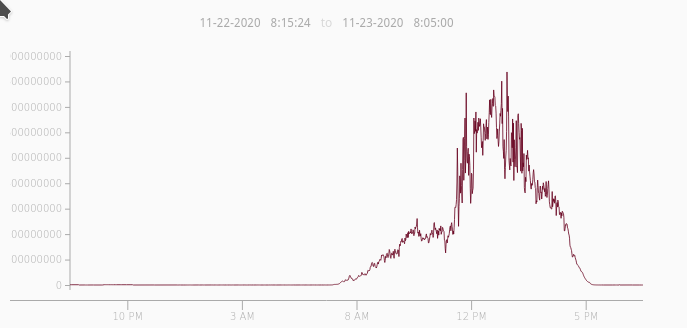

# Monitoring Light with TSL2591 to Automate Lighting
## Setup
### Hardware
* [CQRobot Ambient Light Sensor: TSL25911FN Chip](https://smile.amazon.com/gp/product/B083KM51DF/ref=ppx_yo_dt_b_asin_title_o00_s00?ie=UTF8&psc=1)
* [Raspberry Pi Zero W](https://www.raspberrypi.org/products/raspberry-pi-zero-w/)
* [Sonoff BasicR3 WiFi Switch](https://sonoff.tech/product/wifi-diy-smart-switches/basicr3) - Sonoff switch with the Tasmota firmware. See [Tasmotizer](https://github.com/tasmota/tasmotizer).
* [Raspberry Pi Zero headers](https://www.adafruit.com/product/3413)

### Software
* [bcm2835](https://www.airspayce.com/mikem/bcm2835/) - C library for reading/writing GPIO
* [Paho MQTT C Library](https://www.eclipse.org/paho/index.php?page=clients/c/index.php) - C library for working with MQTT
* [cJSON](https://github.com/DaveGamble/cJSON) - C library for writing, reading, parsing JSON; JSON is used as the MQTT payload
* [mosquitto MQTT broker](https://mosquitto.org/) - Using mosquitto isn't necessary, but a MQTT broker is 

### Recommended
* [Ignition Maker Edition](https://links.inductiveautomation.com/ignition/maker-edition) - Ignition can run on Linux, Windows, Macs, or other architectures. 
Ignition Maker Edition is free to use.

## main.c
I am using the TSL2591 to control turning Christmas lights on/off by sensing the amount of daylight.
The program takes a reading once per minute and then sends command accordingly to turn on/off lights.
It is possible to send on/off commands from SCADA.
Sending commands from SCADA overrides any automatic detection by the program, but resets back to automatic control after a night/day cycle.

The CQRobot team has already created a library to use with their TSL2591 light sensor.
For the Raspberry Pi, there are both C and Python libraries to aid in using the sensor.
The C library uses either BCM2835 or WiringPi. 
I recommend using the BCM2835, as this is what I have been using in my previous projects.

The library developed by CQRobot also comes with an example main.c file, which is the file I modified to use as control for my lights.

Highlights from the code:
* The struct lightSensor has three states, note that the program resets to -1 after a night to day cycle.
  * -1: automatic mode
  *  0: SCADA override for lights OFF
  *  1: SCADA override for lights ON

* Comments beginning with "//NOTE:" usually means there is something to change, such as topic namespace or broker IP.
* To add more topics you would make the following changes:
  * char *subscription_topics[] = {"CHANGEME", "CHANGEME", "CHANGEME"};
  * int qos_topics[] = {0, 0, 0}; //or whatever qos you need
  * MQTTClient_subscribeMany(lightSensorClient, 3, subscription_topics, qos_topics);
* The cJSON_AddItemToObject(scada_data, TEXT, ...) makes an entry into the JSON dict with key TEXT.
There are corresponding cJSON_Create###### with ###### being a JSON type.

## Screenshots
The following screenshots were taken from graphs created in Ignition Make Editition SCADA.
* Lux readings for one full day

* Visible readings for one full day

## ToDo
* Not sure if lux or visible light is the way to control the lights.
Will update as discovery continues.

## Updates
* 2020-11-24: After a trial run, THRESHOLD set to 10.0 is too low. THRESHOLD is now set to 30.
